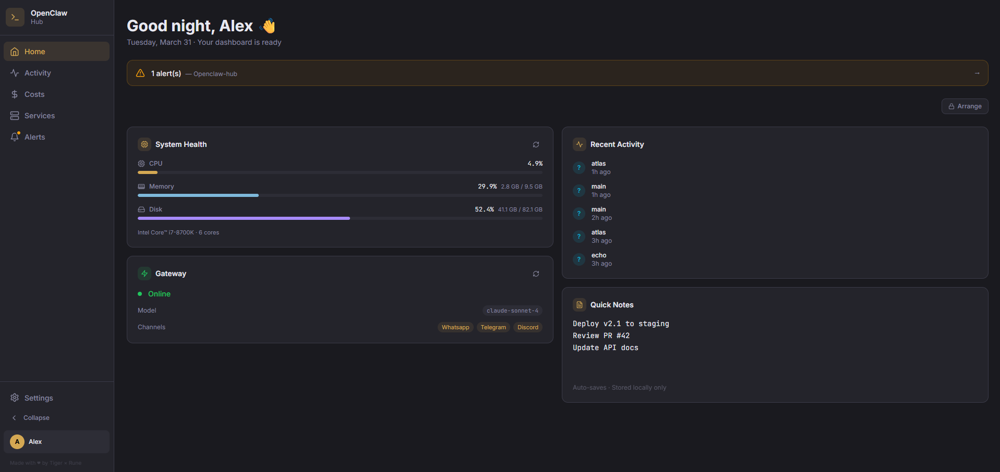
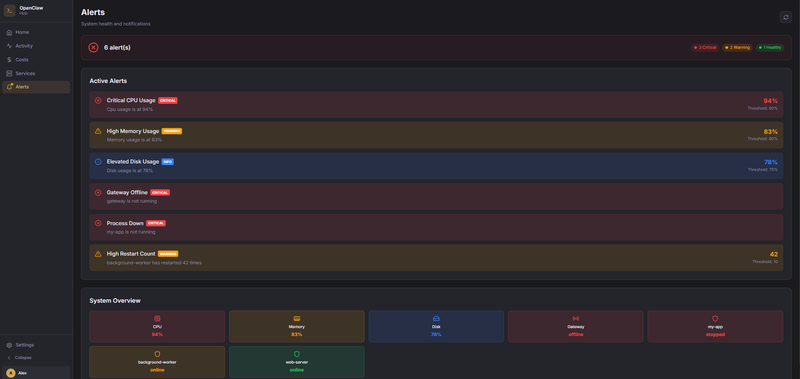
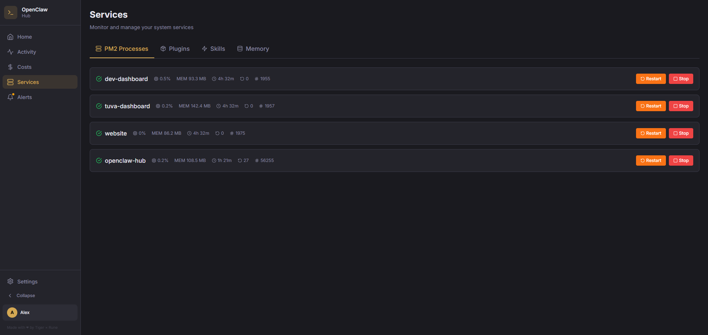
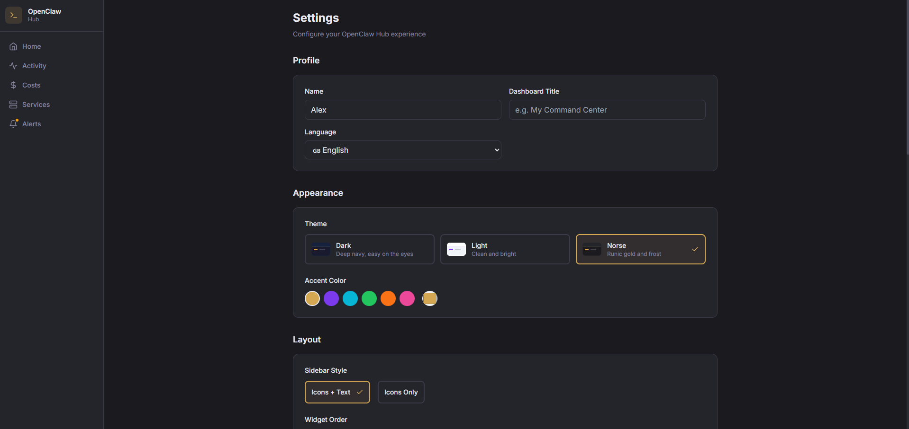

# 🐾 OpenClaw Hub

**Your OpenClaw instance deserves a home page.**

OpenClaw Hub is a personal dashboard for [OpenClaw](https://github.com/openclaw/openclaw) — a single place to see what your AI is doing, how much it costs, and what's running under the hood. Built by [Tiger × Rune](https://tigerandrune.dev) because we wanted a dashboard that respects the same principles OpenClaw does: **your machine, your data, your rules.**

No analytics. No telemetry. No CDN. No external requests. Not even fonts loaded from Google. Everything runs locally, everything stays local.



<details>
<summary>More screenshots</summary>





</details>

---

## What You Get

🏠 **Home** — A widget dashboard you actually want to look at. Drag widgets around, pin quick actions, make it yours.

📊 **Activity** — See what your AI has been up to. Session timeline, usage heatmap, channel breakdown. Know your patterns.

💰 **Costs** — Where the money goes. Model breakdown, daily trends, spending over time. No surprises.

🔧 **Services** — Everything running on your system. PM2 processes, plugins, skills, memory stats. One glance.

🔔 **Alerts** — What went wrong and when. Severity filtering, history, the stuff you need to know.

⌨️ **Command Palette** — `Ctrl+K` and you're there. Search anything, jump anywhere, run actions. If you've used VS Code or Raycast, you know the feeling.

🧩 **Plugins** — Drop a folder, get a widget. Write JSX, we compile it on the fly. No build step, no npm install, no boilerplate. The plugin API gives you theme colors, config, translations — everything you need, nothing you don't.

🌐 **8 Languages** — English, Swedish, German, French, Spanish, Portuguese, Japanese, Chinese. Because not everyone thinks in English.

📱 **Responsive** — Full sidebar on desktop, collapsed on tablet, bottom nav on mobile. It just works.

---

## Get Started

**Requirements:** Node.js 18+ and a running [OpenClaw](https://github.com/openclaw/openclaw) instance.

```bash
git clone https://github.com/tigerandrune/openclaw-hub.git
cd openclaw-hub
npm install
npm run build
npm start
```

Open `http://localhost:3100`. A setup wizard walks you through everything — name, language, theme, widgets, the works. Takes about 30 seconds.

**For production:**

```bash
pm2 start server/index.js --name openclaw-hub
pm2 save
```

## Updating

```bash
cd openclaw-hub
npm run update
```

That's it. Pulls the latest, installs any new dependencies, rebuilds, and restarts PM2 if you're using it. Your config is stored outside the repo (`~/.openclaw/hub-config.json`) so nothing gets overwritten.

---

## Plugins

This is the part we're most proud of.

Plugins are just folders. Two files: a `manifest.json` and a `widget.jsx`. Drop them in `~/.openclaw/hub-plugins/`, and they show up in your dashboard. No restart needed.

```
~/.openclaw/hub-plugins/
  my-plugin/
    manifest.json
    widget.jsx
```

The JSX gets compiled to browser-native ES modules on the fly by esbuild. Your plugin imports from `@openclaw-hub/api` and gets theme colors, persistent config, data fetching, and translations — all with zero setup:

```jsx
import { useTheme, useConfig, useTranslations } from '@openclaw-hub/api';

const i18n = {
  en: { greeting: 'Hello' },
  sv: { greeting: 'Hej' },
};

export default function MyPlugin() {
  const theme = useTheme();
  const t = useTranslations(i18n);
  return <div style={{ color: theme.accent }}>{t('greeting')}</div>;
}
```

There's a complete example in [`examples/plugins/clock/`](examples/plugins/clock/), and the [Kanban Board](https://github.com/tigerandrune/openclaw-hub-kanban) is a real plugin people actually use.

📖 **Docs:** [Creating Plugins](docs/creating-plugins.md) · [Plugin API](docs/plugin-api.md) · [Plugin Security](docs/plugin-security.md) · [Architecture](docs/PLUGIN-ARCHITECTURE.md)

---

## Is It Secure?

Hub ships with security headers (CSP, X-Frame-Options, the works), plugin sandboxing, and path traversal protection. It makes zero external requests — and the CSP enforces that at the browser level.

It has no built-in auth because on localhost, you *are* the auth. For remote access, we recommend Cloudflare Tunnel (free) or Tailscale. The full story is in [SECURITY.md](SECURITY.md).

---

## Something Broken?

```bash
npm test                    # Quick: 33 tests, pass/fail
npm run test:verbose        # Detailed: see every result
npm run test:diagnose       # Full diagnostic: system info + tests
JSON_OUTPUT=1 npm test      # Machine-readable (for AI agents)
```

The test suite was designed to be read by both humans and AI assistants. If your Hub is acting up, run the diagnostic and let your agent figure it out.

---

## Built With

React 19 · Vite · Express · esbuild · Framer Motion · dnd-kit · Lucide

No runtime dependencies on external services. Ever.

---

## Contributing

This is an [OpenClaw](https://github.com/openclaw/openclaw) community project. We'd love your help — whether that's a bug report, a plugin, a translation fix, or a wild idea.

[Join us on Discord](https://discord.com/invite/clawd) · [Report a security issue](SECURITY.md#reporting-vulnerabilities)

---

## Support

This is a passion project — no sponsors, no company, no ads. If our tools help you out, a coffee goes a long way.

[☕ Buy us a coffee on Ko-fi](https://ko-fi.com/tigerxrune) · [tigerandrune.dev](https://tigerandrune.dev)

---

## License

MIT — [Tiger × Rune](https://tigerandrune.dev)

*Built in Umeå, Sweden. One long night, a lot of coffee, and an AI that wouldn't quit.*
